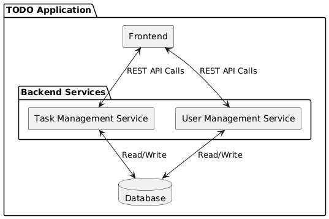

This repository is made for the assignment "build something" for the course PA2577. The application consists of a frontend application and two microservices called auth and todo with a postgresql database. The application is  a todo app which is accessed through the web. The frontend is built with streamlit which is a simple frontend library for python, both microservices are built with fastAPI, a framework for python. The application allows a user to register an account, log in, and then create tasks or delete tasks once logged in. It is a simple app.

# Architecture

| Software Component| Microservice   | Responsibilities|
|-------------------|----------------|-----------------|
| Task Management  | Task Management Service | Create and Delete Tasks, Get all tasks     |
| User Authentication  | User Management Service | User login and registration    |
|Storage|Database|Persistent storage of tasks and users |

Each part is independently deployable and scalable (perhaps not the database as that would require a lot of extra work, I think).
Each microservice can be independently updated and deployed without affecting the other services and each service is accessed through their own REST API.
The architecture follows a standard client-server architecture and a layered architecture, which separates the concerns between frontend and backend.
## Challenges
Microservices can require inter-service communication, which can increase latency and complexity. In my design, none of the services have direct communication,
instead the frontend manages the information it needs from the user service, saves it, and uses it for communicating with the task service, thus reducing the complexity.
A shared database  can lead to to tight coupling between the services, which reduces the independence of the microservices and can be a single point of failure as well as a target for security attacks.
REST API calls can lead to latency, and would require efficient network design.
Regarding security, the user service must have robut authentication and issue tokens using JWT or similar to be considered secure, as well as encrypting sensitive data in the database.
For services to not be overwhelmed with requests, rate limiting and API keys or tokens should be used.
## How to mitigate
To make communication more robust, asynchronous communication via message queues like RabbitMQ can be used, and also retries and circuit breakers for failed requests can be used.
Migrating to a database-per-service architecture improves isolation for the services, but requires that data is synchronized between services when or if needed.
To ensure more performance, caching can be used (redis) to reduce load on the database and APIs.

## Frontend:
This is the interface for users to interact with the system. It uses streamlit.
## Task management Microservice:
The service handles operations related to creating tasks, retrieving tasks and deletion. It is implemented using fastAPI in python
## User Management Microservice:
The service's responsibilites are to create accounts and authenticate when users log in. The technology is the same as above.
## Database
The database acts as a central storage for the user information and task data. Both services make use of the same database.
This reduces the complexity of using multiple databases for each service, and can simplify data consistency,
but it also means that the database can be a single point of failure when scaling and it can also lead to coupling between different microservices.

The source code can be found at:  https://github.com/02zeda/Assignment-Build-Something

